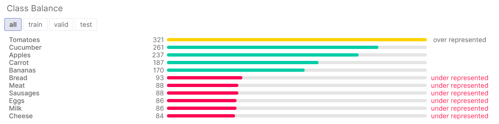
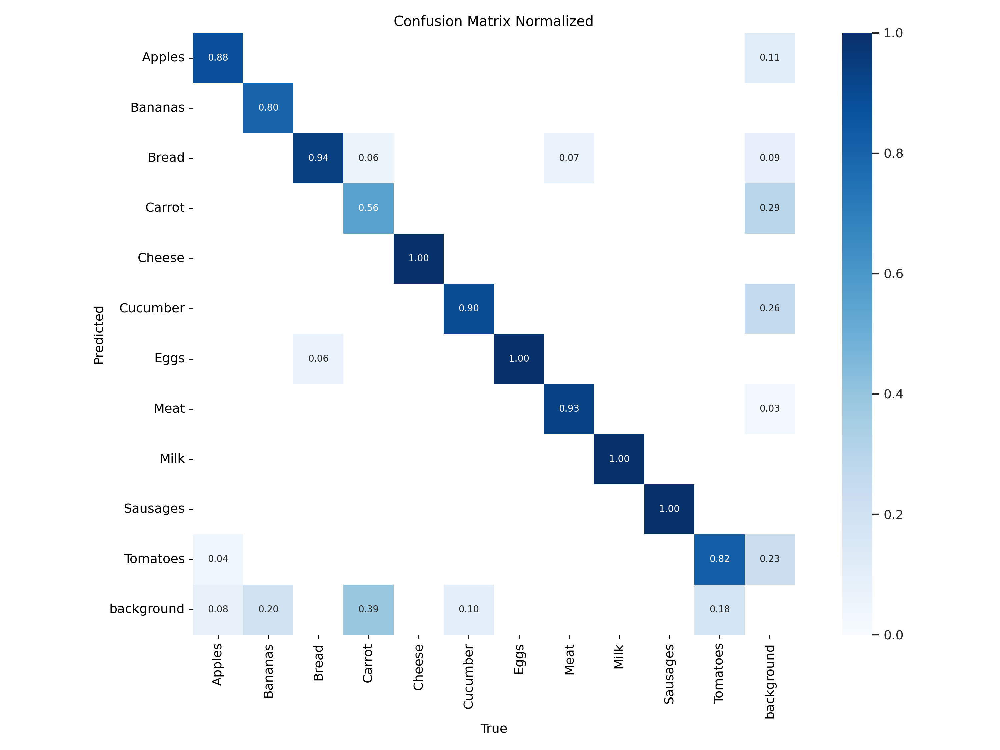
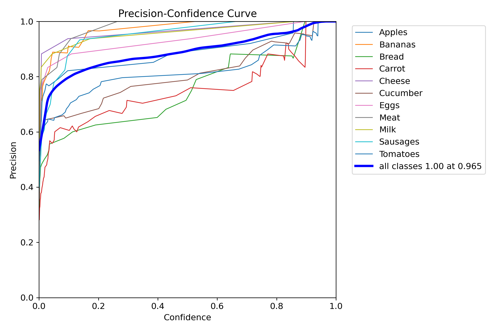
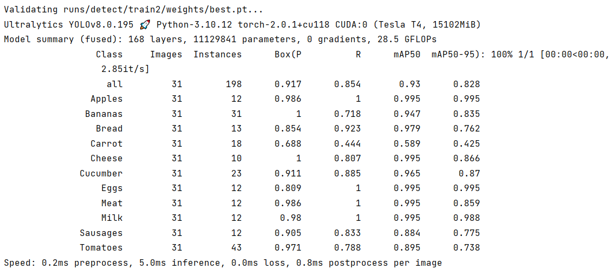
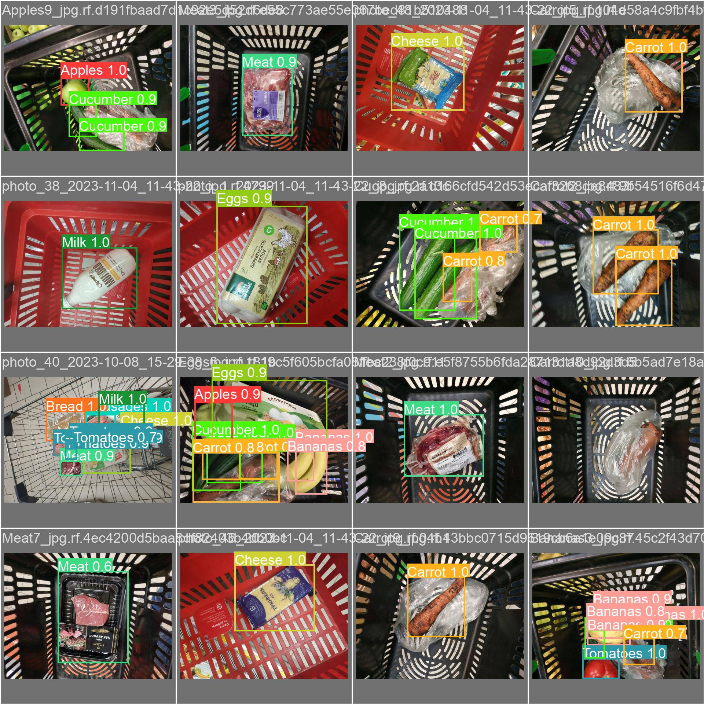

# Practical Machine Learning and Deep Learning course project

## Authors

* Arsen Mutalpov 
* Gleb Kirillov
* Ruslan Kudinov

## Table of Contents

* [Project description](#project-description)
* [Demo](#demo)
* [Dataset](#dataset)
* [Repository structure](#repository-structure)
* [Results](#results)
  * [F1/Recall/Precision](#visuals)
  * [Training metrics](#training-and-validation-results)
  * [Predictions example](#predictions)
* [Prerequisites](#rerequisites)
* [How to use](#how-to-use)
* [Deployment](#project-deployment)

## Project description

In our project we are trying to solve the grocery objects detection problem. For this purpose we created our own [**dataset**](#dataset) with images of different grocery products from local supermarkets Magnit and Pyaterochka. Furthermore, we used this [**custom dataset**](#dataset) to finetune different **YOLO models**.

## Demo


## Dataset

[Custom Grocery dataset (items from local Russian supermarkets)](https://universe.roboflow.com/innopolis-university-5kqay/grocery-products-detection)

Targeted labels (as the most common bought items):


Classes are represented in the following way:



## Repository structure

### [📂 _data_](data)

This directory contains raw collected data. Each subdirectory corresponds to different period of data collection (images were taken once per one-two
week)

### [📂 _notebooks_](notebooks)

This directory contains Jupiter notebooks for various stages of the solution building:

* [📜data_exploration.ipynb](notebooks/data_exploration.ipynb) - notebook for analysis of data properties (e.g. images aspect ratios or bounding boxes area)
* [📜first_explore_yolo_ultralytics_usage.ipynb](notebooks/first_explore_yolo_ultralytics_usage.ipynb) - notebook for examining **YOLO** models on testing samples of our dataset, without model fine-tuning
* [📜train_test_visualize_YOLOv5.ipynb](notebooks) - notebook for fine-tunning **YOLOv5** model
* [📜train_test_visualize_YOLOv8.ipynb](notebooks/train_test_visualize_YOLOv8.ipynb) - notebook for fine-tunning **YOLOv8** model
* [📜final_YOLOv8_train_validate_deploy.ipynb](notebooks/final_YOLOv8_train_validate_deploy.ipynb) - notebook for deploying **final** model to the roboflow project
* [📜sample_usage_trained_YOLOv8.ipynb](notebooks/sample_usage_trained_YOLOv8ipynb) - examples of inferencing on image and video with our trained model with **confidence level** set to **0.715**

### [📂 _reports_](reports)

In this directory you can find progress reports on solution building.

* [📜Report1.pdf](reports/Report1.pdf)
* [📜Report2.pdf](reports/Report2.pdf)
* [📜Report3.pdf](reports/Report3.pdf)

### [📂 _results_](results)

  In this directory the results of testing final **YOLOv8 model** can be found:

#### Visuals






#### Training and validation results




##### Predictions



####     [📂 _results/weights_](results/weights)

This is a storage for our models weights. [best.pt](results/weights/best.pt) is the file with weights for the best found solution, [last.pt](results/weights/last.pt) is the file with weights of the last checkpoint to continute training

###    [📂 _src/scripts_](src/scripts)

This directory contains python script [represent_labels.py](src/scripts/represent_labels.py) used for displaying examples of images for each label

The result of this script can be found in the [**Dataset section**](#dataset)

## Prerequisites

```py
pip install ultralytics
pip install roboflow
```

## How to use

1. You can follow [**sample-usage notebook**](notebooks/sample_usage_trained_YOLOv8.ipynb)
    1. Instantiate ```ultralytics.YOLO('results/weights/best.pt')``` **model**
    1. Use model(image_url) to make a simple inference on an **image**
    1. Use CLI command ```!yolo detect predict model=best.pt source='test.mp4'conf=0.715``` to make an inference on other sources such as **video**

## Project deployment

Follow our telegram bot's [repository](https://github.com/system205/GroceryObjectDetectionTelegramBot). Check the instructions there. In short, you need to run docker compose file with 

```py
docker-compose up
``` 
