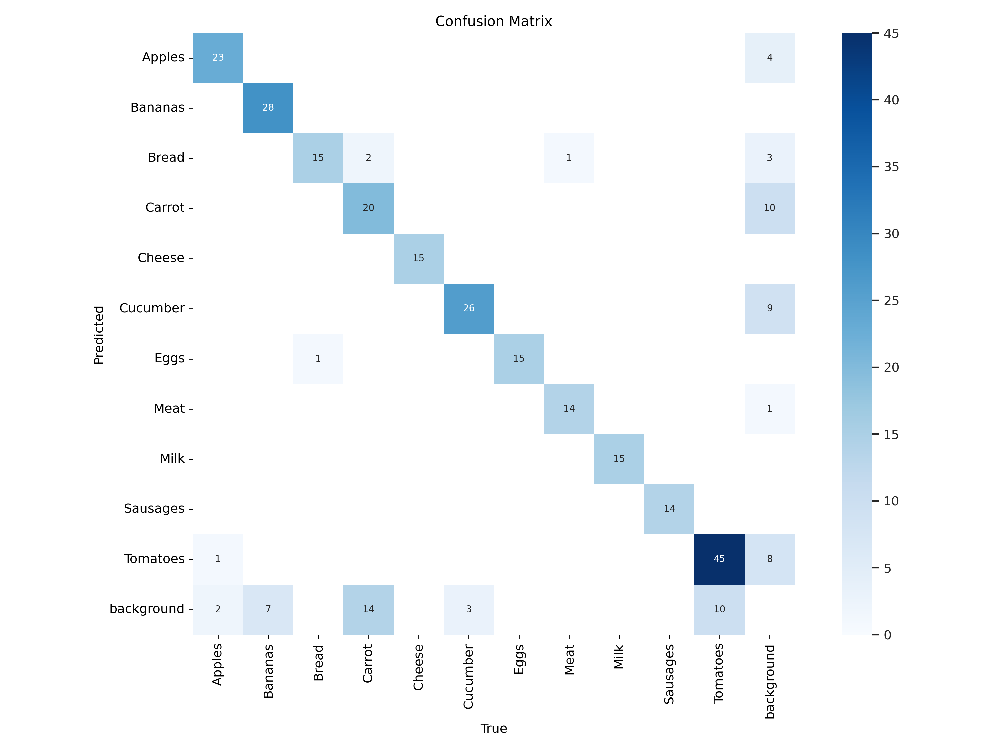
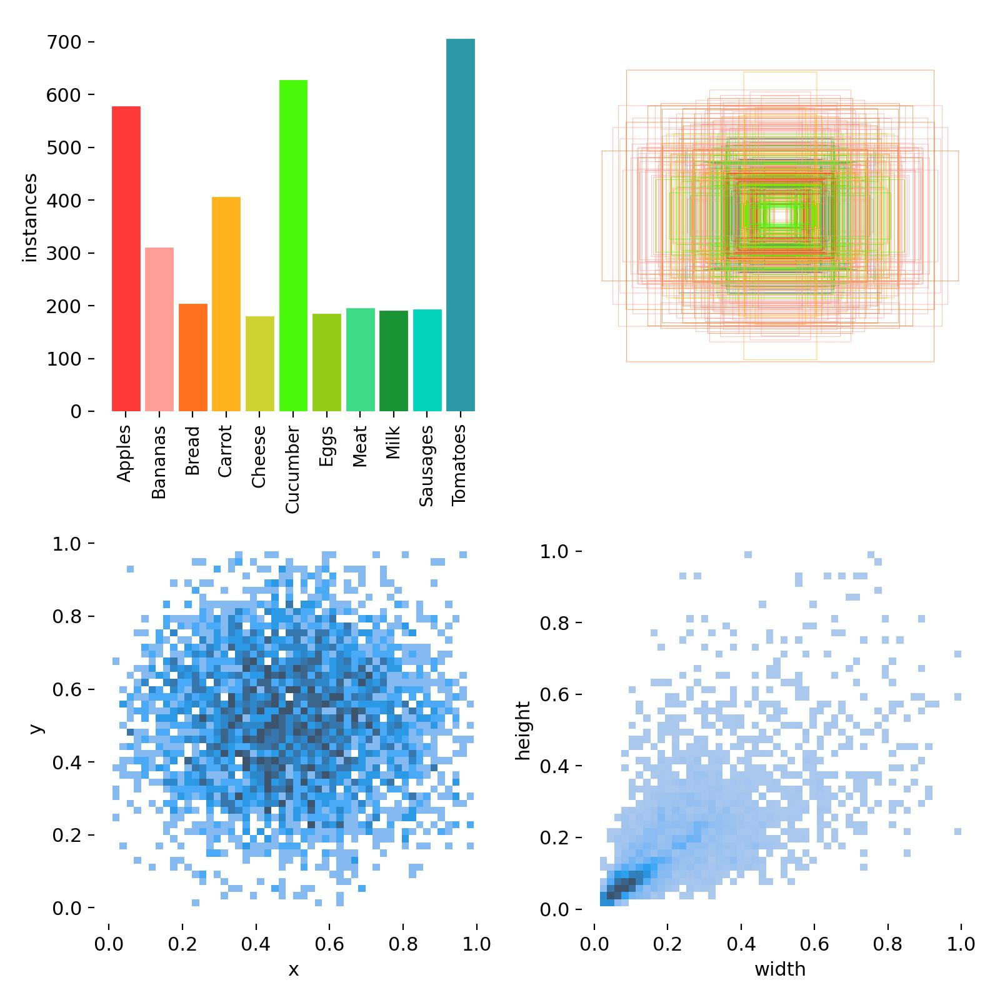
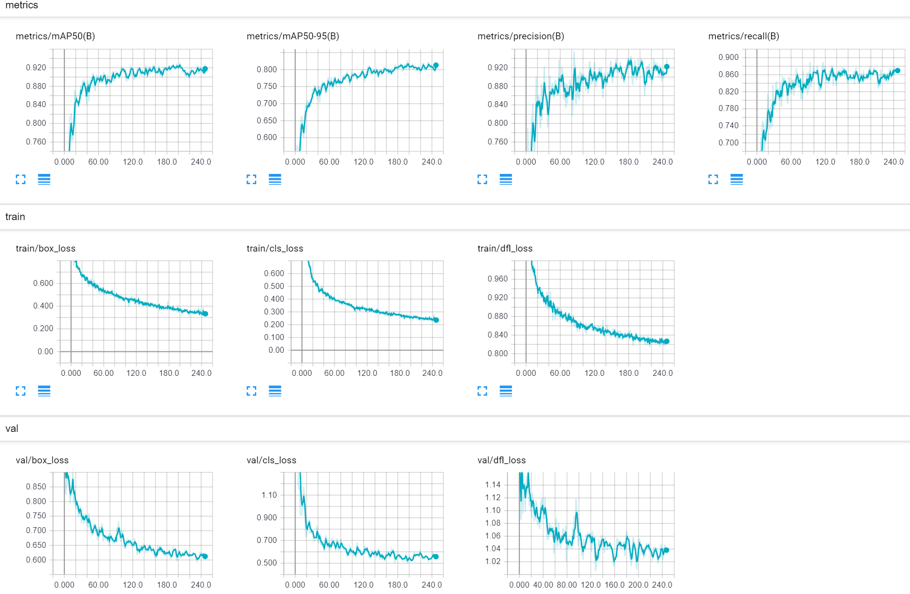
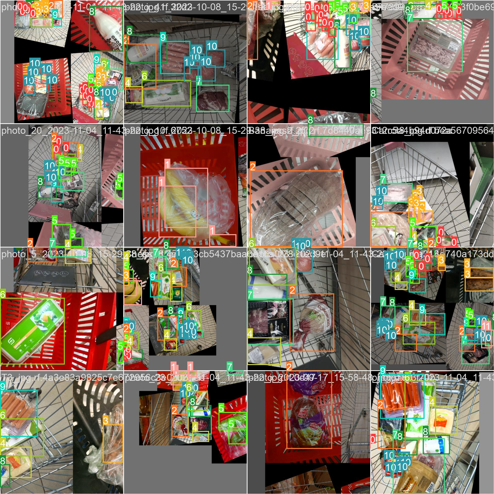
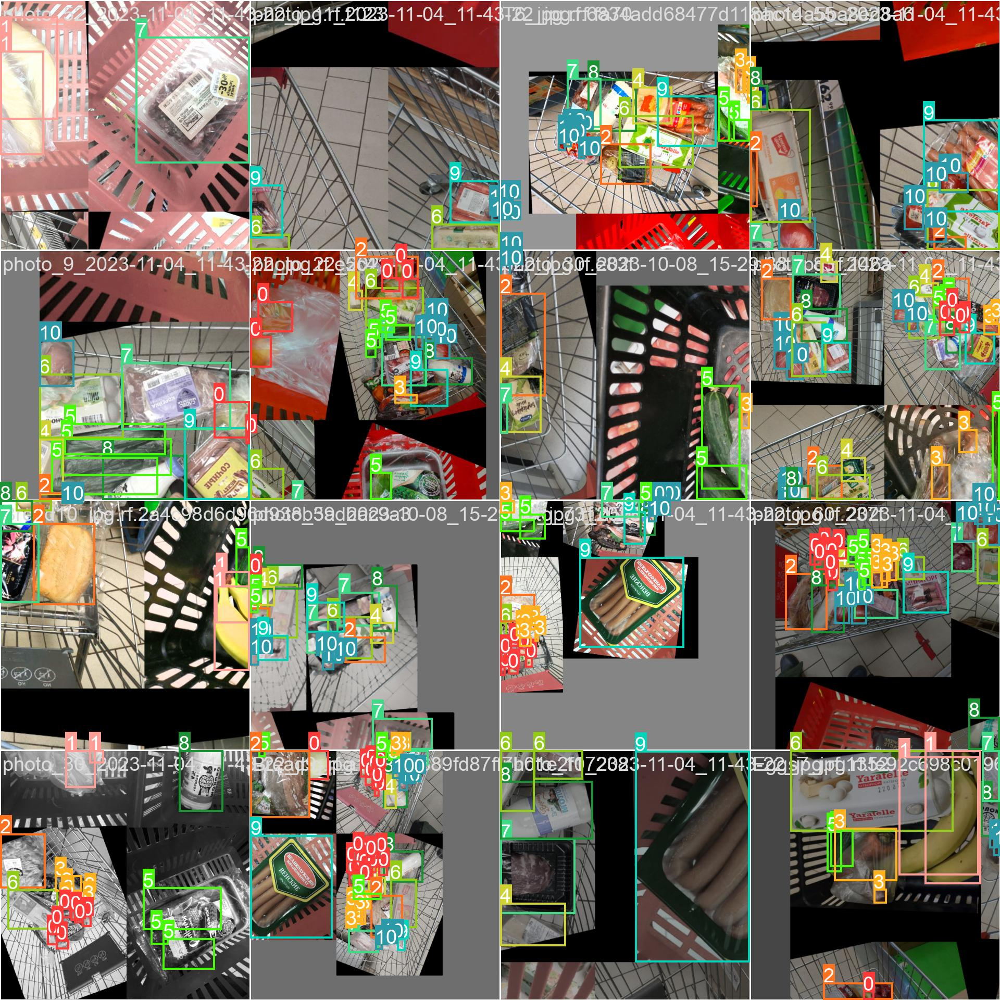
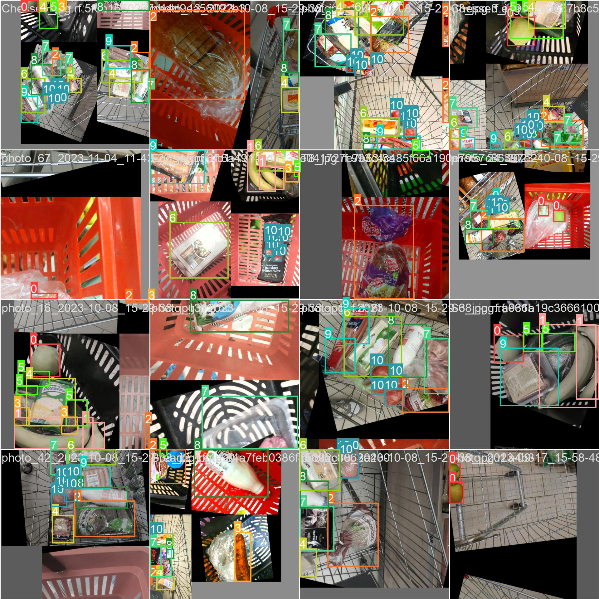

# Practical Machine Learning and Deep Learning course project

## Project description

In our project we are trying to solve the grocery objects detection problem. For this 
purpose we created our own [**dataset**](#dataset) with images of different grocery products from local
supermarkets Magnit and Pyaterochka. Furthermore, we used this [**custom dataset**](#dataset) to finetune
different **YOLO models**.


## Dataset

[Custom Grocery dataset (items from local Russian supermarkets)](https://universe.roboflow.com/innopolis-university-5kqay/grocery-products-detection)

Targeted labels (as the most common bought items):
- Bread
- Milk
- Eggs
- Tomatoes
- Carrot
- Cucumber
- Apples
- Bananas
- Meat
- Sausages
- Cheese

## Repository structure

### &emsp; [_data_](data)
&emsp; This directory is just a preliminary storage for raw collected data. Each subdirectory
corresponds to different period of data collection (images were taken once per one-two
week)

### &emsp; [_notebooks_](notebooks)
&emsp; This directory contains Jupiter notebooks for various stages of the solution building:
* [data_exploration.ipynb](notebooks/data_exploration.ipynb) - notebook for analysis of data properties (e.g. images aspect ratios or bounding boxes area)
* [final_YOLOv8_train_validate_deploy.ipynb](notebooks/final_YOLOv8_train_validate_deploy.ipynb) - notebook for deploying final model to the roboflow project
* [first_explore_yolo_ultralytics_usage.ipynb](notebooks/first_explore_yolo_ultralytics_usage.ipynb) - notebook for examining **YOLO** models on testing samples of our dataset, without model fine-tuning 
* [sample_usage_trained_YOLOv8.ipynb](notebooks/sample_usage_trained_YOLOv8.ipynb) - notebook for object detection on the testing sample of our dataset, using the best found solution
* [train_test_visualize_YOLOv5.ipynb](notebooks) - notebook for examining fine-tuned **YOLOv5** model
* [train_test_visualize_YOLOv8.ipynb](notebooks/train_test_visualize_YOLOv8.ipynb) - notebook for examining fine-tuned **YOLOv8** model

### &emsp; [_reports_](reports)
&emsp; In this directory you can find progress reports for each 2 weeks of our work.
* [Report1.pdf](reports/Report1.pdf)
* [Report2.pdf](reports/Report2.pdf)
* [Report3.pdf](reports/Report3.pdf)

### &emsp; [_results_](results)
&emsp; In this directory the results of testing final **YOLOv8 model** can be found:

#### &emsp; Visuals:

##### &emsp; &emsp; Confusion matrix:



##### &emsp; &emsp; Normalized confusion matrix:


##### &emsp; &emsp; Labels information:



##### &emsp; &emsp; Labels correlogram:


##### &emsp; &emsp; F1-Confidence curves:


##### &emsp; &emsp; Precision-Confidence curves:


##### &emsp; &emsp; Precision-Recall curves:


##### &emsp; &emsp; Recall-Confidence curves:


##### &emsp; &emsp; Results for training and validation:


##### &emsp; &emsp; Results for training and validation from tensorboard:



##### &emsp; &emsp; Targets for training:
###### &emsp; &emsp;&emsp; Batch 1:


###### &emsp; &emsp;&emsp; Batch 2:


###### &emsp; &emsp;&emsp; Batch 3:


##### &emsp; &emsp; Validation targets and predictions:
###### &emsp; &emsp;&emsp; targets:


###### &emsp; &emsp;&emsp; predictions:


#### &emsp; &emsp; [_results/weights_](results/weights)
&emsp; &emsp; This is a storage for our models weights. [best.pt](results/weights/best.pt) is the file with
weights for the best found solution, [last.pt](results/weights/last.pt) is the file
with weights for the solution that was last tested

### &emsp; [_src_](src)
&emsp; This directory contains the source code for use in this project


### &emsp; &emsp;[_src/scripts_](src/scripts)
&emsp; &emsp; This directory contains python script [represent_labels.py](src/scripts/represent_labels.py) used for displaying examples of images for each label

&emsp; &emsp; The result of this script can be found in the [**Data examples section**](#Data-examples)
## Project deployment

Follow our telegram bot's [repository](https://github.com/system205/GroceryObjectDetectionTelegramBot). Check the instructions there. In short, you need to run docker compose file with <```docker-compose up```> command

## Data examples


