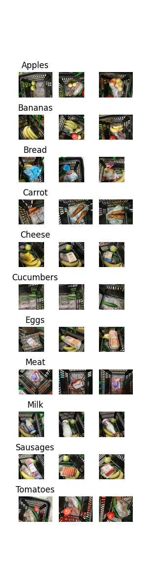

# Practical Machine Learning and Deep Learning course project description

In this repo we store our collected images from local supermarkets Magnit and Pyaterochka. Also, we train and test different YOLO models on grocery object detection task.


## Dataset

Custom Grocery dataset (items from local Russian supermarkets)

Targeted labels (as the most common bought items):
- Bread
- Milk
- Eggs
- Tomatoes
- Carrot
- Cucumber
- Apples
- Bananas
- Meat
- Sausages
- Cheese

## How to use

Follow our telegram bot's [reporistory](https://github.com/system205/GroceryObjectDetectionTelegramBot). Check the instructions there. In short, you need to run docker compose file with <```docker-compose up```> command

## Examples

